# Chapter 20: Face Synthesis

**Yang Wang, Zicheng Liu, and Baining Guo**

---

### 20.1 Introduction

How to synthesize photorealistic images of human faces has been a fascinating yet difficult problem in computer graphics. Here, the term “face synthesis” refers to synthesis of still images as well as synthesis of facial animations. In general, it is difficult to draw a clean line between the synthesis of still images and that of facial animations. For example, the technique of synthesizing facial expression images can be directly used for generating facial animations, and most of the facial animation systems involve the synthesis of still images. In this chapter, we focus more on the synthesis of still images and skip most of the aspects that mainly involve the motion over time.

Face synthesis has many interesting applications. In the film industry, people would like to create virtual human characters that are indistinguishable from the real ones. In games, people have been trying to create human characters that are interactive and realistic. There are commercially available products [18, 19] that allow people to create realistic looking avatars that can be used in chat rooms, e-mail, greeting cards, and teleconferencing. Many human-machine dialog systems use realistic-looking human faces as visual representation of the computer agent that interacts with the human user. Face synthesis techniques have also been used for talking head compression in the video conferencing scenario.

---
**Y. Wang** (✉)  
Carnegie Mellon University, Pittsburgh, PA 15213, USA  
e-mail: wangy@cs.cmu.edu  

**Z. Liu**  
Microsoft Research, Redmond, WA 98052, USA  
e-mail: zliu@microsoft.com  

**B. Guo**  
Microsoft Research Asia, Beijing 100080, China  
e-mail: bainguo@microsoft.com  

*S.Z. Li, A.K. Jain (eds.), Handbook of Face Recognition,*  
*DOI 10.1007/978-0-85729-932-1_20, © Springer-Verlag London Limited 2011*  
*(Page 521)*

---

The techniques of face synthesis can be useful for face recognition too. Romdhani et al. [47, 48] used their three dimensional (3D) face modeling technique for face recognition with different poses and lighting conditions. Qing et al. [44] used the face relighting technique as proposed by Wen et al. [59] for face recognition under a different lighting environment. Wang et al. [57] used the 3D spherical harmonic morphable model (SHBMM), an integration of spherical harmonics into the morphable model framework, for face recognition under arbitrary pose and illumination conditions. Many face analysis systems use an analysis-by-synthesis loop where face synthesis techniques are part of the analysis framework.

In this chapter, we review recent advances on face synthesis including 3D face modeling, face relighting, and facial expression synthesis.

---

### 20.2 Face Modeling

In the past a few years, there has been a lot of work on the reconstruction of face models from images [12, 23, 27, 41, 47, 52, 67]. There are commercially available software packages [18, 19] that allow a user to construct their personalized 3D face models. In addition to its applications in games and entertainment, face modeling techniques can also be used to help with face recognition tasks especially in handling different head poses (see Romdhani et al. [48] and Chap. 10). Face modeling techniques can be divided into three categories: face modeling from an image sequence, face modeling from two orthogonal views, and face modeling from a single image. An image sequence is typically a video of someone’s head turning from one side to the other. It contains a minimum of two views. The motion between each two consecutive views is relatively small, so it is feasible to perform image matching.

#### 20.2.1 Face Modeling from an Image Sequence

Given an image sequence, one common approach for face modeling typically consists of three steps: image matching, structure from motion, and model fitting. First, two or three relatively frontal views are selected, and some image matching algorithms are used to compute point correspondences. The selection of frontal views are usually done manually. Point correspondences are computed either by using dense matching techniques such as optimal flow or feature-based corner matching. Second, one needs to compute the head motion and the 3D structures of the tracked points. Finally, a face model is fitted to the reconstructed 3D points. People have used different types of face model representations including parametric surfaces [13], linear class face scans [5], and linear class deformation vectors [34].

Fua and Miccio [13, 14] computed dense matching using image correlations. They then used a model-driven bundle adjustment technique to estimate the motions and compute the 3D structures. The idea of the model-driven bundle adjustment is to add a regularizer constraint to the traditional bundle adjustment formulation. The

*(Page 522)*

---

constraint is that the reconstructed 3D points can be fit to a parametric face model. Finally, they fit a parametric face model to the reconstructed 3D points. Their parametric face model contains a generic face mesh and a set of control points each controlling a local area of the mesh. By adjusting the coefficients of the control points, the mesh deforms in a linear fashion. Denote $c_1, c_2, \dots, c_m$ to be the coefficients of the control points. Let $R, T, s$ be the rotation, translation, and scaling parameters of the head pose. Denote the mesh of the face as $S = S(c_1, c_2, \dots, c_m)$. Let $\mathcal{T}$ denote the transformation operator, which is a function of $R, T, s$. The model fitting can be formulated as a minimization problem

$$\min_{i} \sum \text{Dist}[P_i, \mathcal{T}(S)] , \qquad (20.1)$$

where $P_i$ is the reconstructed 3D points, and $\text{Dist}(P_i, \mathcal{T}(S))$ is the distance from $P_i$ to the surface $\mathcal{T}(S)$.

This minimization problem can be solved using an iterative closest point approach. First, $c_1, \dots, c_m$ are initialized and fixed. For each point $P_i$, find its closest point $Q_i$ on the surface $S$. Then solve for the pose parameters $R, T, s$ to minimize $\sum_i \| P_i - \mathcal{T}(Q_i) \|$ by using the quaternion-based technique [17]. The head pose parameters are then fixed. Because $S$ is a linear function of $c_1, \dots, c_m$, (20.1) becomes a linear system and can be solved through a least-square procedure. At the next iteration, the newly estimated $c_1, \dots, c_m$ are fixed, and we solve for $R, T, s$ again.

Liu et al. [32, 34] developed a face modeling system that allows an untrained user with a personal computer and an ordinary video camera to create and instantly animate his or her face model. The user first turns his or her head from one side to the other. Then two frames pop up, and the user is required to mark five feature points (two inner eye corners, two mouth corners, and the nose top) on each view. After that, the system is completely automatic. Once the process finishes, his or her constructed face model is displayed and animated. The authors used a feature-based approach to find correspondences. It consists of three steps: (1) detecting corners in each image; (2) matching corners between the two images; (3) detecting false matches based on a robust estimation technique. The reader is referred to Liu et al. [34] for details. Compared to the optical flow approach, the feature-based approach is more robust to intensity and color variations.

After the matching is done, they used both the corner points from the image matching and the five feature points clicked by the user to estimate the camera motion. Because of the matching errors for the corner points and the inaccuracy of the user-clicked points, it is not robust to directly use these points for motion estimation. Therefore they used the physical properties of the user-clicked feature points to improve the robustness. They used the face symmetry property to reduce the number of unknowns and put reasonable bounds on the physical quantities (such as the height of the nose). In this way, the algorithm becomes significantly more robust. The algorithm’s details were described by Liu and Zhang [32].

For the model fitting, they used a linear class of face geometries as their model space. A face was represented as a linear combination of a neutral face (Fig. 20.1) and some number of face *metrics*, where a metric is a vector that linearly deforms

*(Page 523)*

---

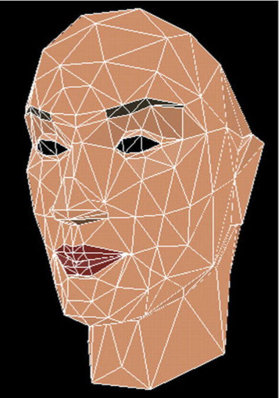  
*Fig. 20.1 Neutral face*

---

a face in certain way, such as to make the head wider, the nose bigger, and so on. To be more precise, let us denote the face geometry by a vector $\mathcal{S} = (\mathbf{v}_1^T, \dots, \mathbf{v}_n^T)^T$, where $\mathbf{v}_i = (X_i, Y_i, Z_i)^T$ ($i = 1, \dots, n$) are the vertices, and a metric by a vector $\mathcal{M} = (\delta\mathbf{v}_1^T, \dots, \delta\mathbf{v}_n^T)^T$, where $\delta\mathbf{v}_i = (\delta X_i, \delta Y_i, \delta Z_i)^T$. Given a neutral face $\mathcal{S}^0 = ((\mathbf{v}_1^0)^T, \dots, ((\mathbf{v}_n^0)^T))^T$ and a set of $m$ metrics $\mathcal{M}^j = ((\delta\mathbf{v}_1^j)^T, \dots, (\delta\mathbf{v}_n^j)^T)^T$, the linear space of face geometries spanned by these metrics is

$$\mathcal{S} = \mathcal{S}^0 + \sum_{j=1}^{m} c_j \mathcal{M}^j \quad \text{subject to} \quad c_j \in [l_j, u_j] \qquad (20.2)$$

where $c_j$ represents the metric coefficients, and $l_j$ and $u_j$ are the valid range of $c_j$.

The model fitting algorithm is similar to the approach by Fua and Miccio [13, 14], described earlier in this section. The advantage of using a linear class of face geometries is that it is guaranteed that every face in the space is a reasonable face, and, furthermore, it has fine-grain control because some metrics are global whereas others are only local. Even with a small number of 3D corner points that are noisy, it is still able to generate a reasonable face model. Figure 20.2 shows side-by-side comparisons of the original images with the reconstructed models for various people.

Note that in both approaches just described the model fitting is separated from the motion estimation. In other words, the resulting face model is not used to improve the motion estimation.

During motion estimation, the algorithm by Liu et al. [34] used only general physical properties about human faces. Even though Fua and Miccio [13, 14] used face model during motion estimation, they used it only as a regularizer constraint. The 3D model obtained with their model-driven bundle adjustment is in general

*(Page 524)*

---

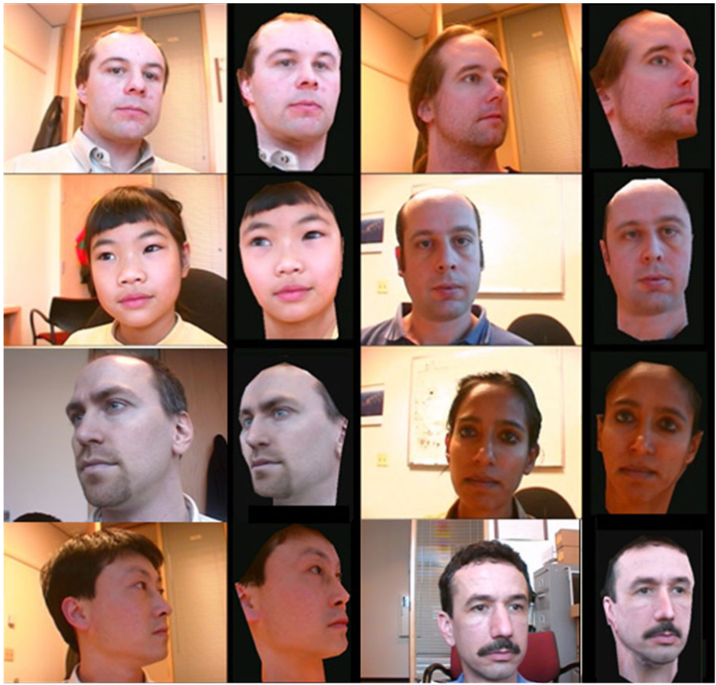  
*Fig. 20.2 Side by side comparison of the original images with the reconstructed models of various people*

---

inaccurate, and they have to throw away the model and use an additional step to recompute the 3D structure. The problem is that the camera motions are fixed on the second step. It may happen that the camera motions are not accurate owing to the inaccurate model at the first stage, so the structure computed at the second stage may not be optimal either. What one needs is to optimize camera motion and structure together.

Shan et al. [49] proposed an algorithm, called model-based bundle adjustment, that combines the motion estimation and model fitting into a single formulation. Their main idea was to directly use the model space as a search space. The model parameters (metric coefficients) become the unknowns in their bundle adjustment formulation. The variables for the 3D positions of the feature points, which are unknowns in the traditional bundle adjustment, are eliminated. Because the number of model parameters is in general much smaller than the isolated points, it results in a smaller search space and better posed optimization system.

*(Page 525)*

---

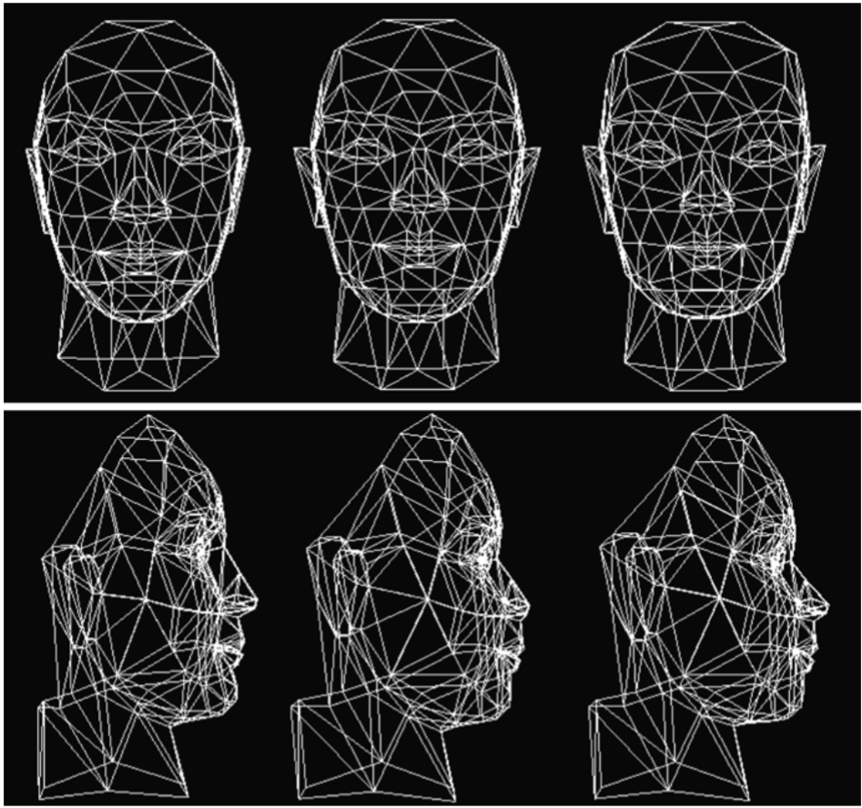  
*Fig. 20.3 Face mesh comparison. Left: traditional bundle adjustment; Middle: ground truth; Right: model-based bundle adjustment. (From Shan et al. [49], with permission)*

---

Figure 20.3 shows the comparisons of the model-based bundle adjustment with the traditional bundle adjustment. On the top are the front views, and on the bottom are the side views. On each row, the one in the middle is the ground truth, on the left is the result from the traditional bundle adjustment, and on the right is the result from the model-based bundle adjustment. By looking closely, we can see that the result of the model-based bundle adjustment is much closer to the ground truth mesh. For example, on the bottom row, the nose on the left mesh (traditional bundle adjustment) is much taller than the nose in the middle (ground truth). The nose on the right mesh (model-based bundle adjustment) is similar to the one in the middle.

#### 20.2.2 Face Modeling from Two Orthogonal Views

A number of researchers have proposed that we create face models from two orthogonal views [1, 8, 20]: one frontal view and one side view. The frontal view

*(Page 526)*

---

provides the information relative to the horizontal and vertical axis, and the side view provides depth information. The user needs to manually mark a number of feature points on both images. The feature points are typically the points around the face features, including eyebrows, eyes, nose, and mouth. Because of occlusions, the number of feature points on the two views are in general different. The quality of the face model depends on the number of feature points the user provides. The more feature points, the better the model, but one needs to balance between the amount of manual work required from the user and the quality of the model.

Because the algorithm is so simple to implement and there is no robustness issue, this approach has been used in some commercially available systems [19]. Some systems provide a semiautomatic interface for marking the feature points to reduce the amount of the manual work. The disadvantage is that it is not convenient to obtain two orthogonal views, and it requires quite a number of manual interventions even with the semiautomatic interfaces.

#### 20.2.3 Face Modeling from a Single Image

Blanz and Vetter [5] developed a system to create 3D face models from a single image. They used both a database of face geometries and a database of face textures. The geometry space is the linear combination of the example faces in the geometry database. The texture space is the linear combination of the example texture images in the image database. Given a face image, they search for the coefficients of the geometry space and the coefficients of the texture space so the synthesized image matches the input image. More details can be found in Chap. 10 and in their paper [5]. One limitation of their current system is that it can only handle the faces whose skin types are similar to the examples in the database. One could potentially expand the image database to cover more varieties of skin types, but there would be more parameters and it is not clear how it is going to affect the robustness of the system.

Liu [31] developed a fully automatic system to construct 3D face models from a single frontal image. They first used a face detection algorithm to find a face and then a feature alignment algorithm to find face features. By assuming an orthogonal projection, they fit a 3D face model by using the linear space of face geometries described in Sect. 20.2.1. Given that there are existing face detection and feature alignment systems [28, 62], implementing this system is simple. The main drawback of this system is that the depth of the reconstructed model is in general not accurate. For small head rotations, however, the model is recognizable. Figure 20.4 shows an example where the left is the input image and the right is the feature alignment result. Figure 20.5 shows the different views of the reconstructed 3D model. Figure 20.6 shows the results of making expressions for the reconstructed face model.

*(Page 527)*

---

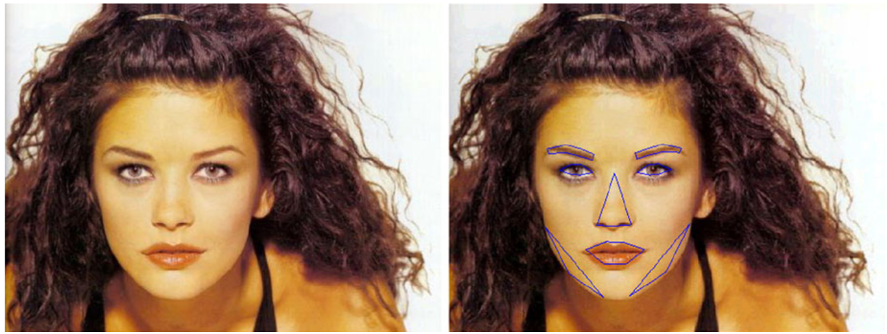  
*Fig. 20.4 Left: input image. Right: the result from image alignment. (From Liu [31], with permission)*

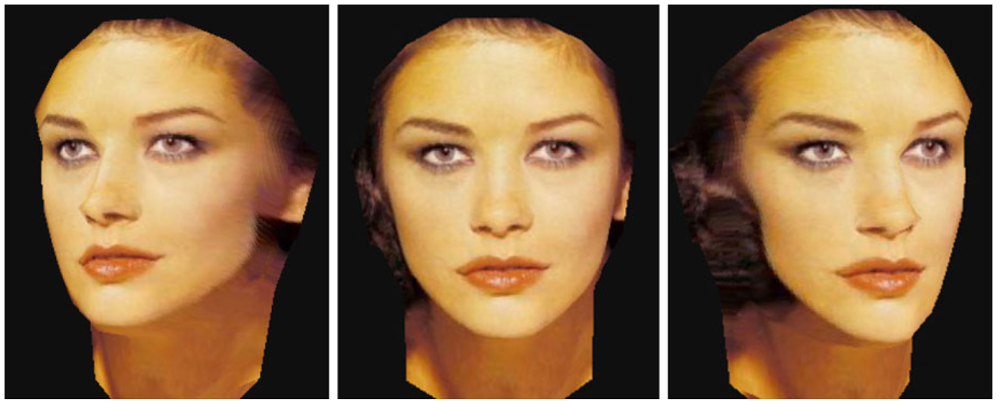  
*Fig. 20.5 Views of the 3D model generated from the input image in Fig. 20.4. (From Liu [31], with permission)*

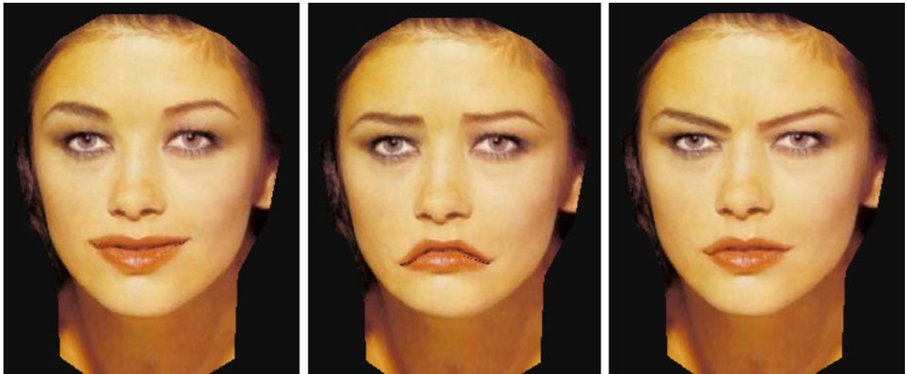  
*Fig. 20.6 Generating different expressions for the constructed face model. (From Liu [31], with permission)*

---

*(Page 528)*

---

### 20.3 Face Relighting

During the past several years, a lot of progress has been made on generating photo-realistic images of human faces under arbitrary lighting conditions [21, 26, 50, 53, 57, 64]. One class of method is inverse rendering [9, 10, 15, 36, 38, 63]. By capturing the lighting environment and recovering surface reflectance properties, one can generate photo-realistic rendering of objects including human faces under new lighting conditions. To recover the surface reflectance properties, one typically needs special setting and capturing equipment. Such systems are best suited for studio-like applications.

#### 20.3.1 Face Relighting Using Ratio Images

Riklin-Raviv and Shashua [46] proposed a ratio-image technique to map one person’s lighting condition to a different person. Given a face under two different lighting conditions, and another face under the first lighting condition, they used the color ratio (called the quotient image) to generate an image of the second face under the second lighting condition. For any given point on the face, let $\rho$ denote its albedo, and $\mathbf{n}$ its normal. Let $E(\mathbf{n})$ and $E'(\mathbf{n})$ be the irradiances under the two lighting conditions, respectively. Assuming a Lambertian reflectance model, the intensities of this point under the two lighting conditions are $I = \rho E(\mathbf{n})$ and $I' = \rho E'(\mathbf{n})$. Given a different face, let $\rho_1$ be its albedo. Then its intensities on the two lighting conditions are $I_1 = \rho_1 E(\mathbf{n})$, and $I'_1 = \rho_1 E'(\mathbf{n})$. Therefore, we have

$$\frac{I_1}{I} = \frac{I'_1}{I'} . \qquad (20.3)$$

Thus,

$$I'_1 = I' \frac{I_1}{I} . \qquad (20.4)$$

Equation (20.4) shows that one can obtain $I'_1$ from $I$, $I'$, and $I_1$. If we have one person’s images under all possible lighting conditions and the second person’s image under one of the lighting conditions, we can use (20.4) to generate the second person’s images under all the other lighting conditions.

In many applications, we do not know in which lighting condition the second person’s image is. Riklin-Raviv and Shashua [46] proposed that we use a database of images of different people under different lighting conditions. For any new person, if its albedo is “covered by” (formally called “rational span”, see Riklin-Raviv and Shashua [46] for details) the albedos of the people in the database, it is possible to figure out in which lighting condition the new image was.

*(Page 529)*

---

#### 20.3.2 Face Relighting from a Single Image

Researchers have developed face relighting techniques that do not require a database [21, 57, 59, 64]. Given a single image of a face, Wen et al. [59] first computed a special radiance environment map assuming known face geometry. For any point on the radiance environment map, its intensity is the irradiance at the normal direction multiplied by the average albedo of the face. In other words, the special radiance environment map is the irradiance map times a constant albedo. Zhang and Samaras [64] and Jiang et al. [21] proposed statistical approaches to recover the spherical harmonic basis images from the input image. A bootstrap step is required to obtain the statistical texture and shape information of human faces. To estimate the lighting, shape and albedo of a human face simultaneously from a single image, Wang et al. [57] used the 3D spherical harmonic morphable model (SHBMM), an integration of spherical harmonics into the morphable model framework. Thus, any face under arbitrary pose and illumination conditions can be represented simply by three low dimensional vectors: shape parameters, spherical harmonic basis parameters, and illumination coefficients. In this section, we describe the technique proposed by Wen et al. [59] in more detail.

Given a single image of a face, Wen et al. [59] computed the special radiance environment map using spherical harmonic basis functions [3, 45]. Accordingly, the irradiance can be approximated as a linear combination of nine spherical harmonic basis functions [3, 45].

$$E(\mathbf{n}) \approx \sum_{l \le 2, -l \le m \le l} \hat{A}_l L_{lm} Y_{lm}(\mathbf{n}) . \qquad (20.5)$$

Wen et al. [59] also expanded the albedo function $\rho(\mathbf{n})$ using spherical harmonics

$$\rho(\mathbf{n}) = \rho_{00} + \Psi(\mathbf{n}) \qquad (20.6)$$

where $\rho_{00}$ is the constant component, and $\Psi(\mathbf{n})$ contains other higher order components.

From (20.5) and (20.6), we have

$$\rho(\mathbf{n})E(\mathbf{n}) \approx \rho_{00} \sum_{l \le 2, -l \le m \le l} \hat{A}_l L_{lm} Y_{lm}(\mathbf{n}) + \Psi(\mathbf{n}) \sum_{l \le 2, -l \le m \le l} \hat{A}_l L_{lm} Y_{lm}(\mathbf{n}) .$$

If we assume $\Psi(\mathbf{n})$ does not have first four order ($l = 1, 2, 3, 4$) components, the second term of the righthand side in (20.7) contains components with orders equal to or higher than 3 (see Wen et al. [59] for the explanation). Because of the orthogonality of the spherical harmonic basis, the nine coefficients of order $l \le 2$ estimated from $\rho(\mathbf{n})E(\mathbf{n})$ with a linear least-squares procedure are $\rho_{00}\hat{A}_l L_{lm}$, where ($l \le 2, -l \le m \le l$). Therefore, we obtain the radiance environment map with a reflectance coefficient equal to the average albedo of the surface.

Wen et al. [59] argued that human face skin approximately satisfies the above assumption, that is, it does not contain low frequency components other than the constant term.

*(Page 530)*

---

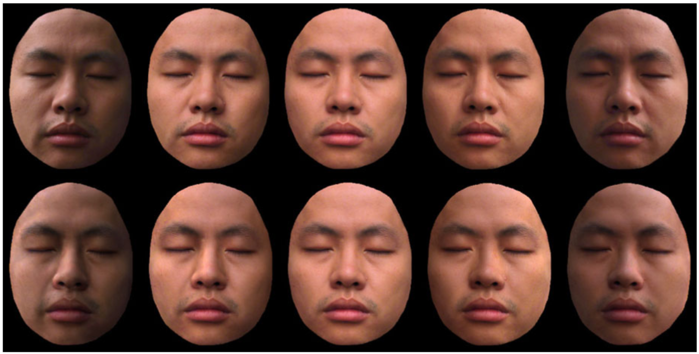  
*Fig. 20.7 Comparison of synthesized results and ground truth. The top row is the ground truth. The bottom row is the synthesized result, where the middle image is the input. (From Wen et al. [59], with permission)*

---

By using a generic 3D face geometry, Wen et al. [59] set up the following system of equations:

$$I(\mathbf{n}) = \sum_{l \le 2, -l \le m \le l} x_{lm} Y_{lm}(\mathbf{n}) . \qquad (20.7)$$

They used a linear least-squares procedure to solve the nine unknowns $x_{lm}$, $l \le 2$, $-l \le m \le l$, thus obtaining the special radiance environment map.

One interesting application is that one can relight the face image when the environment rotates. For the purpose of explanation, let us imagine the face rotates while the environment is static. Given a point on the face, its intensity is $I_f = \rho E(\mathbf{n})$. The intensity of the corresponding point on the radiance environment map is $I_s(\mathbf{n}) = \bar{\rho} E(\mathbf{n})$, where $\bar{\rho}$ is the average albedo of the face. After rotation, denote $\mathbf{n}'$ to be the new normal. The new intensity on the face is $I'_f = \rho E(\mathbf{n}')$. The intensity on the radiance environment map corresponding to the $\mathbf{n}'$ is $I_s(\mathbf{n}') = \bar{\rho} E(\mathbf{n}')$. Therefore,

$$I'_f = I_f \frac{I_s(\mathbf{n}')}{I_s(\mathbf{n})} . \qquad (20.8)$$

The bottom row of Fig. 20.7 shows the relighting results. The input image is the one in the middle. The images at the top are the ground truth. We can see that the synthesized results match well with the ground truth images. There are some small differences mainly on the first and last images due to specular reflections. (According to Marschner et al. [37], human skin is almost Lambertian at small light incidence angles and has strong non-Lambertian scattering at higher angles.)

Another application is that one can modify the estimated spherical harmonic coefficients to generate radiance environment maps under the modified lighting con-

*(Page 531)*

---

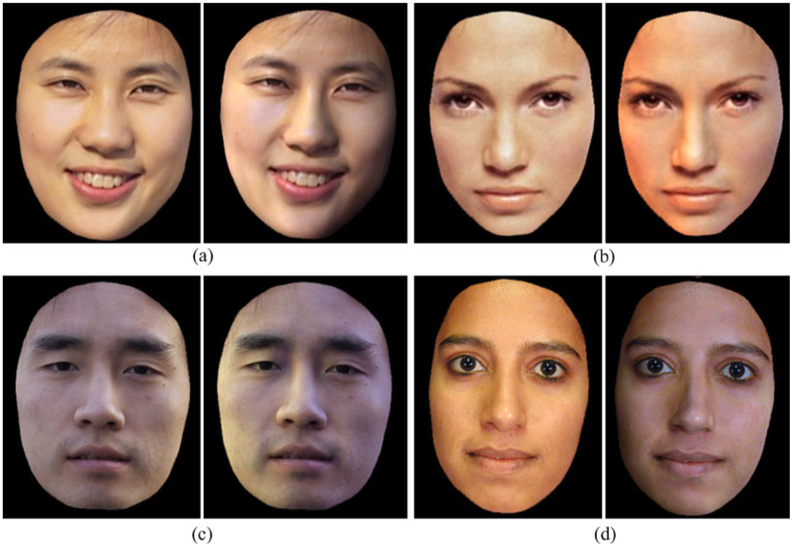  
*Fig. 20.8 Lighting editing by modifying the spherical harmonics coefficients of the radiance environment map. The left image in each pair is the input image and the right image is the result after modifying the lighting. (From Wen et al. [59], with permission)*

---

ditions. For each new radiance environment map, one can use the ratio-image technique (see (20.8)) to generate the face image under the new lighting condition. In this way, one can modify the lighting conditions of the face. In addition to lighting editing, this can also be used to generate training data with different lighting conditions for face detection or face recognition applications.

Figure 20.8 shows four examples of lighting editing by modifying the spherical harmonics coefficients. For each example, the left image is the input image, and the right image is the result after modifying the lighting. In example (a), lighting is changed to attach shadow to the person’s left face. In example (b), the light on the person’s right face is changed to be more reddish, and the light on her left face becomes slightly more bluish. In (c), the bright sunlight move from the person’s left face to his right face. In (d), we attach shadow to the person’s right face and change the light color as well.

#### 20.3.3 Application to Face Recognition Under Varying Illumination

Qing et al. [44] used the face relighting technique as described in the previous section for face recognition under different lighting environments. For any given face

*(Page 532)*

---

image under unknown illumination, they first applied the face relighting technique to generate a new image of the face under canonical illumination. Canonical illumination is the constant component of the spherical harmonics, which can be obtained by keeping only the constant coefficient ($x_{00}$ in (20.7)) while setting the rest of the coefficients to zero. The ratio-image technique of (20.8) is used to generate the new image under canonical illumination.

Image matching is performed on the images under canonical illumination. Qing et al. [44] performed face recognition experiments with the PIE database [51]. They reported significant improvement of the recognition rate after using face relighting. The reader is referred to their article [44] for detailed experimental results.

---

### 20.4 Facial Expression Synthesis

In the past several years, facial expression synthesis has been an active research topic [7, 11, 24, 29, 35, 54, 56, 66]. Generally face expression synthesis techniques can be divided into three categories: physically based facial expression synthesis, morph-based facial expression synthesis, and expression mapping (also called performance-driven animation).

#### 20.4.1 Physically Based Facial Expression Synthesis

One of the early physically based approaches is the work by Badler and Platt [2], who used a mass and spring model to simulate the skin. They introduced a set of muscles. Each muscle is attached to a number of vertices of the skin mesh. When the muscle contracts, it generates forces on the skin vertices, thereby deforming the skin mesh. A user generates facial expressions by controlling the muscle actions.

Waters [58] introduced two types of muscles: linear and sphincter. The lips and eye regions are better modeled by the sphincter muscles. To gain better control, they defined an influence zone for each muscle so the influence of a muscle diminishes as the vertices are farther away from the muscle attachment point.

Terzopoulos and Waters [55] extended Waters’ model by introducing a three-layer facial tissue model. A fatty tissue layer is inserted between the muscle and the skin, providing more fine grain control over the skin deformation. This model was used by Lee et al. [25] to animate Cyberware scanned face meshes.

One problem with the physically based approaches is that it is difficult to generate natural looking facial expressions. There are many subtle skin movement, such as wrinkles and furrows, that are difficult to model with a mass-and-spring scheme.

#### 20.4.2 Morph-Based Facial Expression Synthesis

Given a set of 2D or 3D expressions, one could blend these expressions to generate new expressions. This technique is called morphing or interpolation. This technique

*(Page 533)*

---

was first reported in Parke’s pioneer work [40]. Beier and Neely [4] developed a feature-based image morphing technique to blend 2D images of facial expressions. Bregler et al. [6] applied the morphing technique to mouth regions to generate lip-synch animations.

Pighin et al. [42] used the morphing technique on both the 3D meshes and texture images to generate 3D photorealistic facial expressions. They first used a multiview stereo technique to construct a set of 3D facial expression examples for a given person. Then they used the convex linear combination of the examples to generate new facial expressions. To gain local control, they allowed the user to specify an active region so the blending affects only the specified region. The advantage of this technique is that it generates 3D photorealistic facial expressions. The disadvantage is that the possible expressions this technique can generate is limited. The local control mechanism greatly enlarges the expression space, but it puts burdens on the user. The artifacts around the region boundaries may occur if the regions are not selected properly. Joshi et al. [22] developed a technique to automatically divide the face into subregions for local control. The region segmentation is based on the analysis of motion patterns for a set of example expressions.

#### 20.4.3 Expression Mapping

Expression mapping (also called performance-driven animation) has been a popular technique for generating realistic facial expressions. This technique applies to both 2D and 3D cases. Given an image of a person’s neutral face and another image of the same person’s face with an expression, the positions of the face features (e.g., eyes, eyebrows, mouths) on both images are located either manually or through some automatic method. The difference vector of the feature point positions is then added to a new face’s feature positions to generate the new expression for that face through geometry-controlled image warping (we call it geometric warping) [4, 30, 61]. In the 3D case, the expressions are meshes, and the vertex positions are 3D vectors. Instead of image warping, one needs a mesh deformation procedure to deform the meshes based on the feature point motions [16].

Williams [60] developed a system to track the dots on a performer’s face and map the motions to the target model. Litwinowicz and Williams [30] used this technique to animate images of cats and other creatures.

Because of its simplicity, the expression mapping technique has been widely used in practice. One great example is the FaceStation system developed by Eyematic [19]. The system automatically tracks a person’s facial features and maps his or her expression to the 3D model on the screen. It works in real time without any markers.

There has been much research done to improve the basic expression mapping technique. Pighin et al. [42] parameterized each person’s expression space as a convex combination of a few basis expressions and proposed mapping one person’s expression coefficients to those of another person. It requires that the two people

*(Page 534)*

---

have the same number of basis expressions and that there is a correspondence between the two basis sets. This technique was extended by Pyun et al. [43]. Instead of using convex combination, Pyun et al. [43] proposed to the use of radial basis functions to parameterize the expression space.

Noh and Neumann [39] developed a technique to automatically find a correspondence between two face meshes based on a small number of user-specified correspondences. They also developed a new motion mapping technique. Instead of directly mapping the vertex difference, this technique adjusts both the direction and the magnitude of the motion vector based on the local geometries of the source and target model.

##### 20.4.3.1 Mapping Expression Details

Liu et al. [33] proposed a technique to map one person’s facial expression details to a different person. Facial expression details are subtle changes in illumination and appearance due to skin deformations. The expression details are important visual cues, but they are difficult to model and synthesize. Given a person’s neutral face image and an expression image, Liu et al. [33] observed that the illumination changes caused by the skin deformations can be extracted in a skin color independent manner using an expression ratio image (ERI). The ERI can then be applied to a different person’s face image to generate the correct illumination changes caused by the skin deformation of that person’s face.

Let $I_a$ be person A’s neutral face image, let $I'_a$ be A’s expression image. Given a point on the face, let $\rho_a$ be its albedo, and let $\mathbf{n}$ be its normal on the neutral face. Let $\mathbf{n}'$ be the normal when the face makes the expression. By assuming Lambertian model, we have $I_a = \rho_a E(\mathbf{n})$ and $I'_a = \rho_a E(\mathbf{n}')$. Taking the ratio, we have:

$$\frac{I'_a}{I_a} = \frac{E(\mathbf{n}')}{E(\mathbf{n})} . \qquad (20.9)$$

Note that $\frac{I'_a}{I_a}$ captures the illumination changes due to the changes in the surface normals; furthermore, it is independent of A’s albedo. $\frac{I'_a}{I_a}$ is called the expression ratio image. Let $I_b$ be person B’s neutral face image. Let $\rho_b$ be its albedo. By assuming that B and A have similar surface normals on their corresponding points, we have $I_b = \rho_b E(\mathbf{n})$. Let $I'_b$ be the image of B making the same expression as A; then $I'_b = \rho_b E(\mathbf{n}')$. Therefore,

$$\frac{I'_b}{I_b} = \frac{E(\mathbf{n}')}{E(\mathbf{n})} \qquad (20.10)$$

and so

$$I'_b = I_b \frac{I'_a}{I_a} . \qquad (20.11)$$

Therefore, we can compute $I'_b$ by multiplying $I_b$ with the expression ratio image.

*(Page 535)*

---

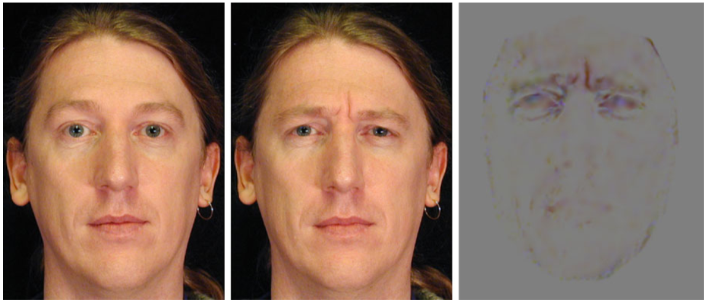  
*Fig. 20.9 Expression ratio image. Left: neutral face. Middle: expression face. Right: expression Ratio image. The ratios of the RGB components are converted to colors for display purpose. (From Liu et al. [33], with permission)*

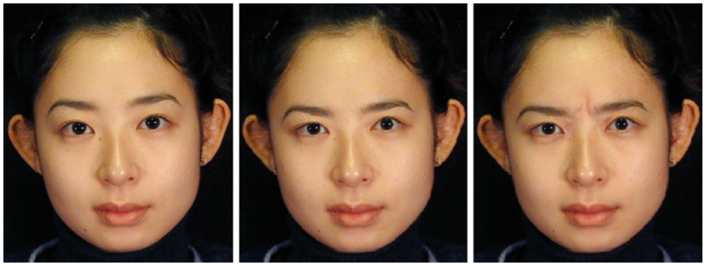  
*Fig. 20.10 Mapping a thinking expression. Left: neutral face. Middle: result from geometric warping. Right: result from ERI. (From Liu et al. [33], with permission)*

---

Figure 20.9 shows a male subject’s thinking expression and the corresponding ERI. Figure 20.10 shows the result of mapping the thinking expression to a female subject. The image in the middle is the result of using traditional expression mapping. The image on the right is the result generated using the ERI technique. We can see that the wrinkles due to skin deformations between the eyebrows are mapped well to the female subject. The resulting expression is more convincing than the result from the traditional geometric warping. Figure 20.12 shows the result of mapping the smile expression (Fig. 20.11) to Mona Lisa. Figure 20.13 shows the result of mapping the smile expression to two statues.

##### 20.4.3.2 Geometry-Driven Expression Synthesis

One drawback of the ERI technique is that it requires the expression ratio image from the performer. Zhang et al. [65] proposed a technique that requires only the fea-

*(Page 536)*

---

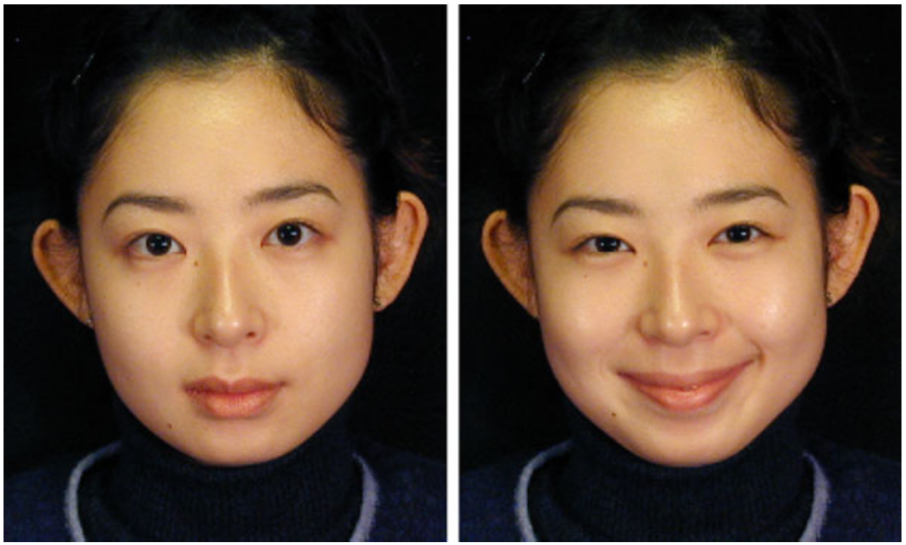  
*Fig. 20.11 Smile expression used to map to other people’s faces*

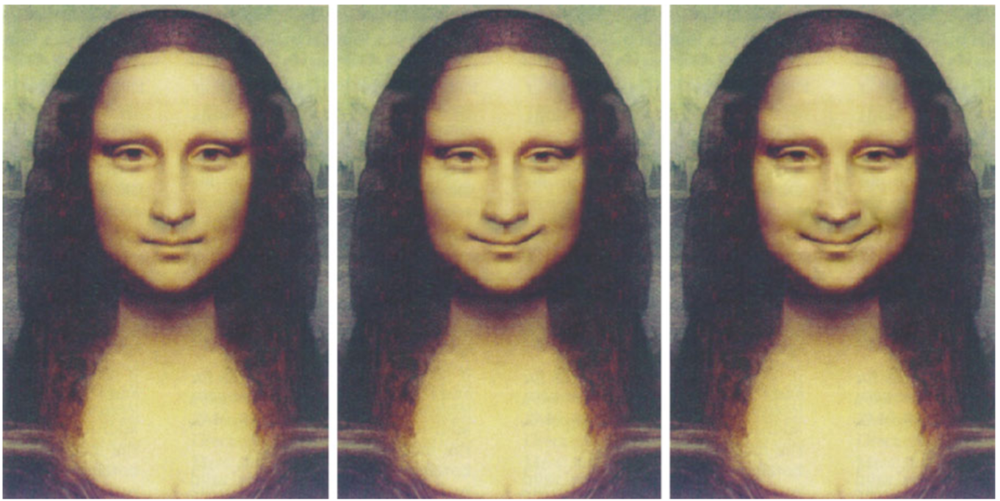  
*Fig. 20.12 Mapping a smile to Mona Lisa’s face. Left: “neutral” face. Middle: result from geometric warping. Right: result from ERI. (From Liu et al. [33], with permission)*

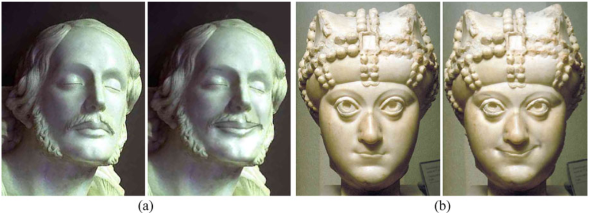  
*Fig. 20.13 Mapping expressions to statues. a Left: original statue. Right: result from ERI. b Left: another statue. Right: result from ERI. (From Liu et al. [33], with permission)*

---

*(Page 537)*

---

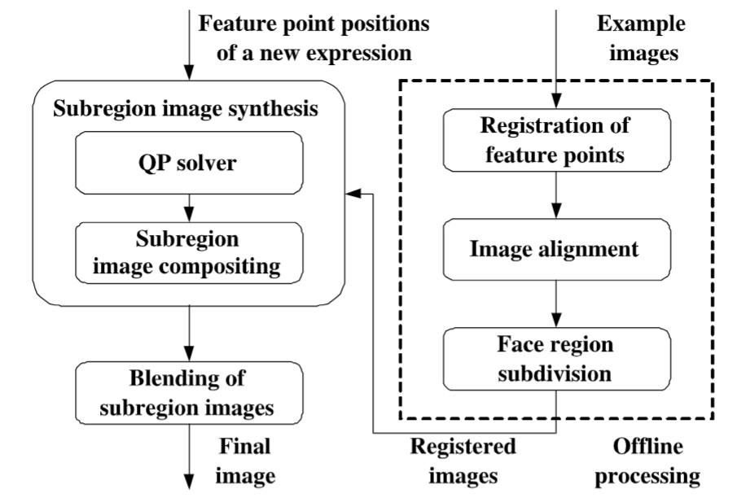  
*Fig. 20.14 Geometry-driven expression synthesis system. (From Zhang et al. [65], with permission)*

---

ture point motions from the performer, as for traditional expression mapping. One first computes the desired feature point positions (geometry) for the target model, as for traditional expression mapping. Based on the desired feature point positions, the expression details for the target model are synthesized from examples.

Let $E_i = (G_i, I_i)$, $i = 0, \dots, m$, be the example expressions where $G_i$ represents the geometry and $I_i$ is the texture image (assuming that all the texture images $I_i$ are pixel aligned). Let $H(E_0, E_1, \dots, E_m)$ be the set of all possible convex combinations of these examples. Then

$$H(E_0, E_1, \dots, E_m) = \left\{ \left. \left( \sum_{i=0}^{m} c_i G_i, \sum_{i=0}^{m} c_i I_i \right) \;\right|\; \sum_{i=0}^{m} c_i = 1, c_i \ge 0, i = 0, \dots, m \right\} . \qquad (20.12)$$

Note that each expression in the space $H(E_0, E_1, \dots, E_m)$ has a geometric component $G = \sum_{i=0}^{m} c_i G_i$ and a texture component $I = \sum_{i=0}^{m} c_i I_i$. Because the geometric component is much easier to obtain than the texture component, Zhang et al. [65] proposed using the geometric component to infer the texture component. Given the geometric component $G$, one can project $G$ to the convex hull spanned by $G_0, \dots, G_m$ and then use the resulting coefficients to composite the example images and obtain the desired texture image.

To increase the space of all possible expressions, they proposed subdividing the face into a number of subregions. For each subregion, they used the geometry associated with this subregion to compute the subregion texture image. The final expression is then obtained by blending these subregion images together. Figure 20.14 is an overview of their system. It consists of an offline processing unit and a run-time unit. The example images are processed offline only once. At run time, the system takes as input the feature point positions of a new expression. For each sub-

*(Page 538)*

---

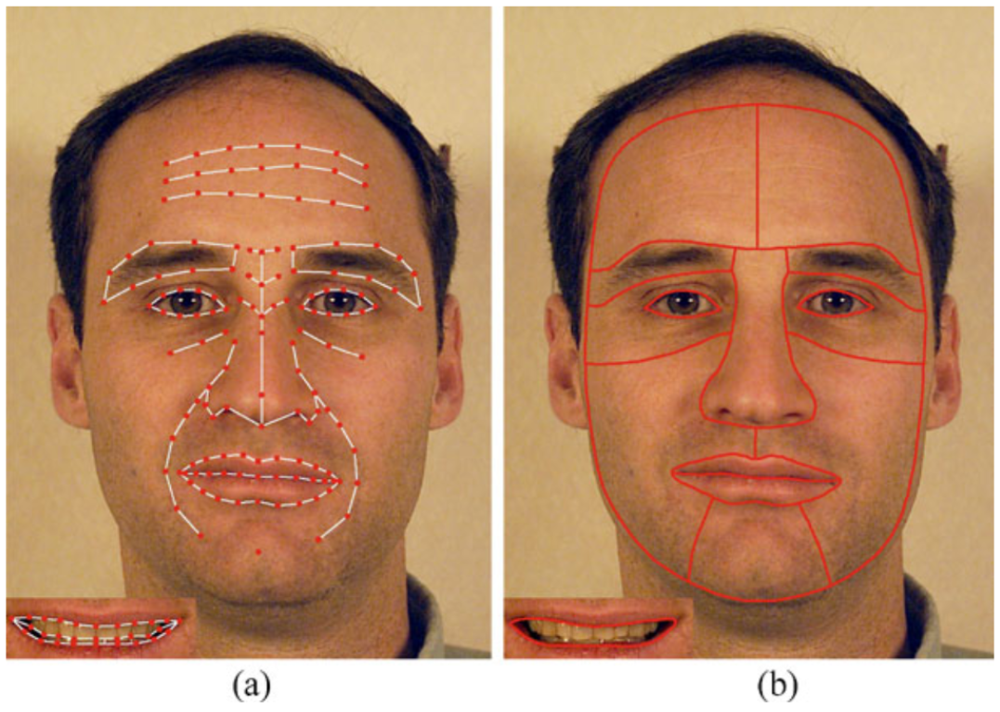  
*Fig. 20.15 a Feature points. b Face region subdivision. (From Zhang et al. [65], with permission)*

---

region, they solve the quadratic programming problem of (20.12) using the interior point method. They then composite the example images in this subregion together to obtain the subregion image. Finally, they blend the subregion images together to produce the expression image.

Figure 20.15a shows the feature points they used by Zhang et al. [65]. Figure 20.15b shows the face region subdivision. From Fig. 20.15a, we can see that the number of feature points used for their synthesis system is large. The reason is that more feature points are better for the image alignment and for the quadratic programming solver. The problem is that some feature points, such as those on the forehead, are quite difficult to obtain from the performer, and they are person-dependent. Thus these feature points are not suited for expression mapping. To address this problem, they developed a motion propagation technique to infer feature point motions from a subset. Their basic idea was to learn how the rest of the feature points move from the examples. To have fine-grain control, they divided the face feature points into hierarchies and performed hierarchical principal component analysis on the example expressions.

There are three hierarchies. At hierarchy 0, they used a single feature point set that controls the global movement of the entire face. There are four feature point sets at hierarchy 1, each controlling the local movement of facial feature regions (left eye region, right eye region, nose region, mouth region). Each feature point set at hierarchy 2 controls details of the face regions, such as eyelid shape, lip line shape, and so on. There are 16 feature point sets at hierarchy 2. Some facial feature points belong to several sets at different hierarchies, and they are used as bridges between global and local movement of the face, so the vertex movements can be propagated from one hierarchy to another.

For each feature point set, Zhang et al. [65] computed the displacement of all the vertices belonging to this feature set for each example expression. They then performed principal component analysis on the vertex displacement vectors corresponding to the example expressions and generated a lower dimensional vector space. The hierarchical principal component analysis results are then used to propa-

*(Page 539)*

---

gate vertex motions so that from the movement of a subset of feature points one can infer the most reasonable movement for the rest of the feature points.

Let $v_1, v_2, \dots, v_n$ denote all the feature points on the face. Let $\delta V$ denote the displacement vector of all the feature points. For any given $\delta V$ and a feature point set $F$ (the set of indexes of the feature points belonging to this feature point set), let $\delta V(F)$ denote the subvector of those vertices that belong to $F$. Let $\text{Proj}(\delta V, F)$ denote the projection of $\delta V(F)$ into the subspace spanned by the principal components corresponding to $F$. In other words, $\text{Proj}(\delta V, F)$ is the best approximation of $\delta V(F)$ in the expression subspace. Given $\delta V$ and $\text{Proj}(\delta V, F)$, let us say that $\delta V$ is *updated* by $\text{Proj}(\delta V, F)$ if for each vertex that belongs to $F$ its displacement in $\delta V$ has been replaced with its corresponding value in $\text{Proj}(\delta V, F)$.

The motion propagation algorithm takes as input the displacement vector for a subset of the feature points, say, $\Delta v_{i_1}, \Delta v_{i_2}, \dots, \Delta v_{i_k}$. Denote $T = \{i_1, i_2, \dots, i_k\}$. Below is a description of the motion propagation algorithm.

```text
MotionPropagation
Begin
  Set δV = 0.
  While (stop-criteria is not met) Do
    For each i_k ∈ T, set δV(i_k) = Δv_{i_k}.
    For all Feature point set F, set hasBeenProcessed(F) to be false.
    Find the feature point set F with the lowest hierarchy such that F ∩ T ≠ ∅.
    MotionPropagationFeaturePointSet(F).
  End
End
```

The function `MotionPropagationFeaturePointSet` is defined as follows:

```text
MotionPropagationFeaturePointSet(F*)
Begin
  Set h to be the hierarchy of F*.
  If hasBeenProcessed(F*) is true, return.
  Compute Proj(δV, F*).
  Update δV with Proj(δV, F*).
  Set hasBeenProcessed(F*) to be true.
  For each feature set F belonging to hierarchy h - 1 such that F ∩ F* ≠ ∅.
    MotionPropagationFeaturePointSet(F).
  For each feature set F belonging to hierarchy h + 1 such that F ∩ F* ≠ ∅.
    MotionPropagationFeaturePointSet(F).
End
```

The algorithm initializes $\delta V$ to a zero vector. At the first iteration, it sets $\delta V(i_k)$ to be equal to the input displacement vector for vertex $v_{i_k}$. Then it finds the feature point set with the lowest hierarchy so it intersects with the input feature point set $T$ and calls *MotionPropagationFeaturePointSet*. The function uses principal component analysis to infer the motions for the rest of the vertices in this feature point set. It then recursively calls *MotionPropagationFeaturePointSet* on other feature point

*(Page 540)*

---

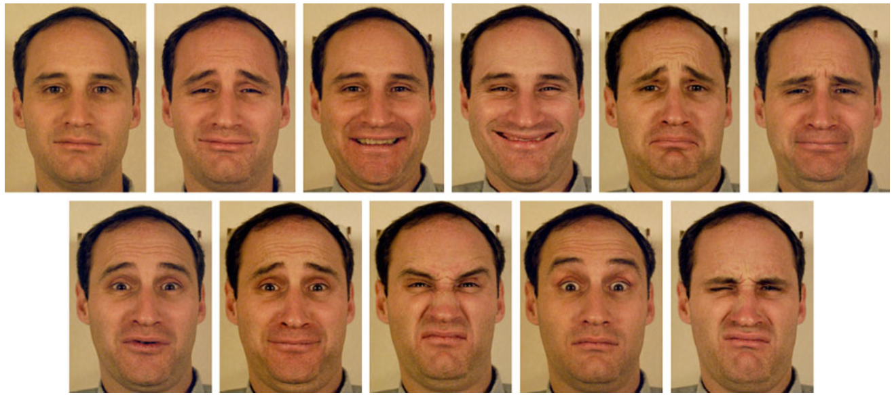  
*Fig. 20.16 Example images of the male subject. (From Zhang et al. [65], with permission)*

---

sets. At the end of the first iteration, $\delta V$ contains the inferred displacement vectors for all the feature points. Note that for the vertex in $T$ its inferred displacement vector may be different from the input displacement vector because of the principal component projection. At the second iteration, $\delta V(i_k)$ is reset to the input displacement vector for all $i_k \in T$. The process repeats.

Figure 20.16 shows example images of a male subject, and Fig. 20.17 shows the results of mapping a female subject’s expressions to this male subject.

In addition to expression mapping, Zhang et al. [65] applied their techniques to expression editing. They developed an interactive expression editing system that allows a user to drag a face feature point, and the system interactively displays the resulting image with expression details. Figure 20.18 is a snapshot of their interface. The red dots are the feature points that the user can click and drag. Figure 20.19 shows some of expressions generated by the expression editing system.

### 20.5 Discussion

We have reviewed recent advances on face synthesis including face modeling, face relighting, and facial expression synthesis. There are many open problems that remain to be solved.

One problem is how to generate face models with fine geometric details. As discussed in Sect. 20.2, many 3D face modeling techniques use some type of model space to constrain the search, thereby improving the robustness. The resulting face models in general do not have the geometric details, such as creases and wrinkles. Geometric details are important visual cues for human perception. With geometric details, the models look more realistic; and for personalized face models, they look more recognizable to human users. Geometric details can potentially improve computer face recognition performance as well.

Another problem is how to handle non-Lambertian reflections. The reflection of human face skin is approximately specular when the angle between the view

*(Page 541)*

---

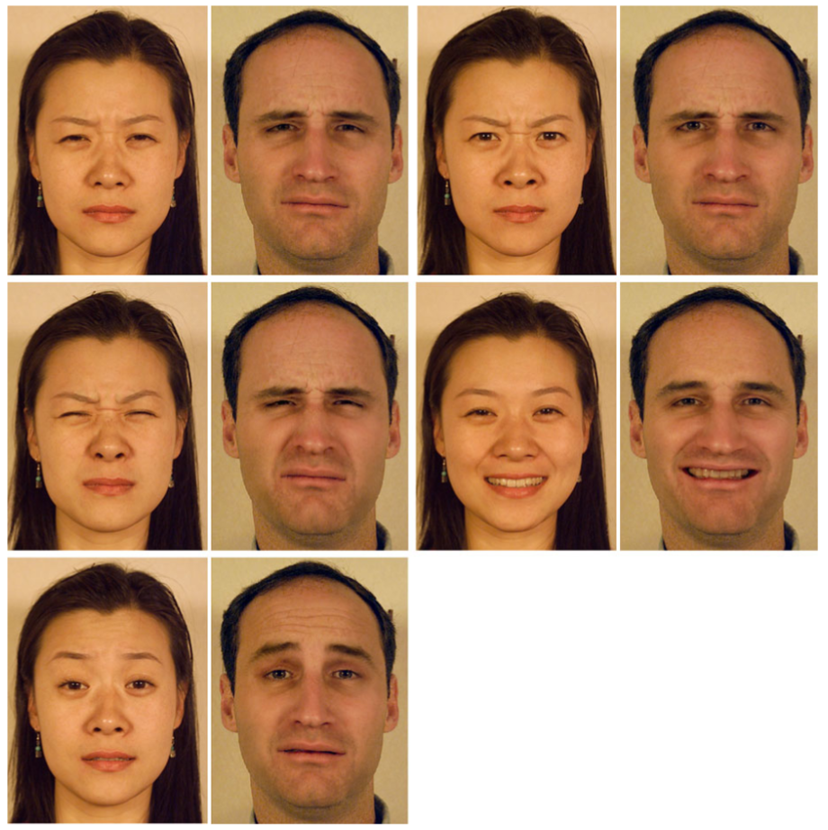  
*Fig. 20.17 Results of the enhanced expression mapping. The expressions of the female subject are mapped to the male subject. (From Zhang et al. [65], with permission)*

---

direction and lighting direction is close to 90°. Therefore, given any face image, it is likely that there are some points on the face whose reflection is not Lambertian. It is desirable to identify the non-Lambertian reflections and use different techniques for them during relighting.

How to handle facial expressions in face modeling and face relighting is another interesting problem. Can we reconstruct 3D face models from expression images? One would need a way to identify and undo the skin deformations caused by the expression. To apply face relighting techniques on expression face images, we would need to know the 3D geometry of the expression face to generate correct illumination for the areas with strong deformations.

One ultimate goal in face animation research is to be able to create face models that look and move just like a real human character. Not only do we need to synthe-

*(Page 542)*

---

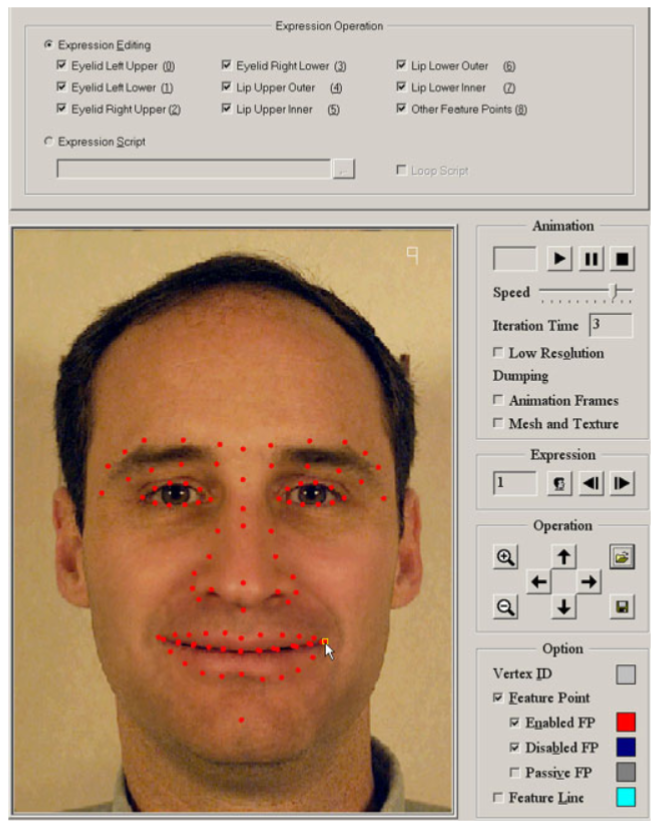  
*Fig. 20.18 The expression editing interface. The red dots are the feature points which a user can click on and drag. (From Zhang et al. [65], with permission)*

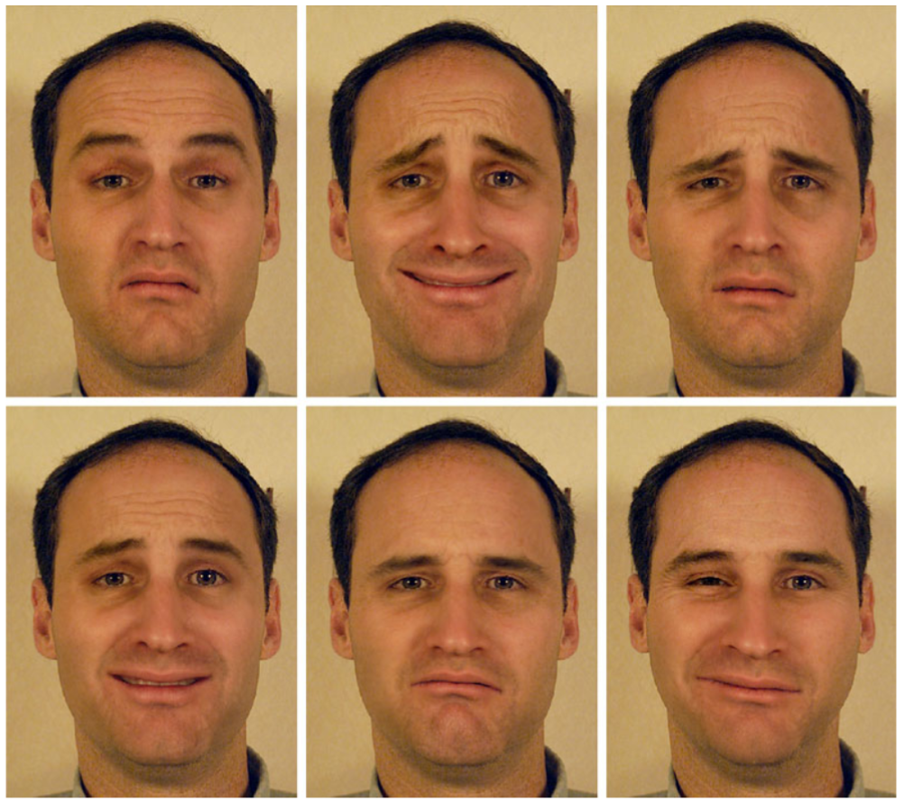  
*Fig. 20.19 Expressions generated by the expression editing system. (From Zhang et al. [65], with permission)*

---

*(Page 543)*

---

size facial expression, we also need to synthesize the head gestures, eye gazes, hair, and the movements of lips, teeth, and tongue.

Face synthesis techniques can be potentially used for face detection and face recognition to handle different head poses, different lighting conditions, and different facial expressions. As we discussed earlier, some researchers have started applying some face synthesis techniques to face recognition [44, 48]. We believe that there are many more opportunities along this line, and that it is a direction worth exploring.

**Acknowledgements** We thank Ying-Li Tian for carefully reading our manuscripts and providing critical reviews. We also thank Zhengyou Zhang, Alex Acero, and Heung-Yeung Shum for their support.

### References

1. Akimoto, T., Suenaga, Y., Wallace, R.S.: Automatic 3d facial models. IEEE Comput. Graph. Appl. **13**(5), 16–22 (1993)
2. Badler, N., Platt, S.: Animating facial expressions. In: Computer Graphics, pp. 245–252. Siggraph, August 1981
3. Basri, R., Jacobs, D.: Lambertian reflectance and linear subspaces. In: Proc. ICCV’01, pp. 383–390 (2001)
4. Beier, T., Neely, S.: Feature-based image metamorphosis. In: Computer Graphics, pp. 35–42. Siggraph, July 1992
5. Blanz, V., Vetter, T.: A morphable model for the synthesis of 3d faces. In: Computer Graphics, Annual Conference Series, pp. 187–194. Siggraph, August 1999
6. Bregler, C., Covell, M., Slaney, M.: Video rewrite: Driving visual speech with audio. In: Computer Graphics, pp. 353–360. Siggraph, August 1997
7. Chuang, E., Bregler, C.: Mood swings: expressive speech animation. ACM Trans. Graph. **24**(2), 331–347 (2005)
8. Dariush, B., Kang, S.B., Waters, K.: Spatiotemporal analysis of face profiles: Detection, segmentation, and registration. In: Proc. of the 3rd International Conference on Automatic Face and Gesture Recognition, pp. 248–253. IEEE, New York (1998)
9. Debevec, P.E.: Rendering synthetic objects into real scenes: Bridging traditional and image-based graphics with global illumination and high dynamic range photography. In: Computer Graphics, Annual Conference Series, pp. 189–198. Siggraph, July 1998
10. Debevec, P.E., Hawkins, T., Tchou, C., Duiker, H.-P., Sarokin, W., Sagar, M.: Acquiring the reflectance field of a human face. In: Computer Graphics, Annual Conference Series, pp. 145–156. Siggraph, July 2000
11. Deng, Z., Neumann, U.: Data-Driven 3D Facial Animation. Springer, Berlin (2007)
12. Dimitrijevic, M., Ilic, S., Fua, P.: Accurate face models from uncalibrated and ill-lit video sequences. In: Computer Vision and Pattern Recognition, vol. II, pp. 1034–1041 (2004)
13. Fua, P., Miccio, C.: From regular images to animated heads: A least squares approach. In: Eurographics of Computer Vision, pp. 188–202 (1996)
14. Fua, P., Miccio, C.: Animated heads from ordinary images: A least-squares approach. Comput. Vis. Image Underst. **75**(3), 247–259 (1999)
15. Georgiades, A., Belhumeur, P., Kriegman, D.: Illumination-based image synthesis: Creating novel images of human faces under differing pose and lighting. In: IEEE Workshop on Multi-View Modeling and Analysis of Visual Scenes, pp. 47–54 (1999)
16. Guenter, B., Grimm, C., Wood, D., Malvar, H., Pighin, F.: Making faces. In: Computer Graphics, Annual Conference Series, pp. 55–66. Siggraph, July 1998

*(Page 544)*
